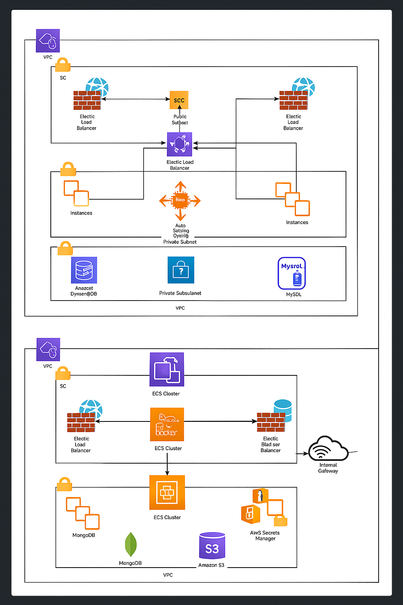

<p align="center">
  
</p>


# 👓 Optic Booking Platform  
A modern cloud-ready booking platform built for optical stores. Customers can book appointments, browse products, manage profiles, and store owners get a full admin dashboard with booking management, schedules, and analytics.

---

## 🚀 Features

### 🧑‍💻 User Features
- Book eye-checkup appointments  
- Receive booking confirmations & reminders  
- Manage profile, history & preferences  
- Browse frames/lenses (if enabled)

### 🛠 Admin Features
- Manage bookings & scheduling  
- Update availability and store timings  
- Manage customer records  
- Dashboard with metrics (appointments per day/week, cancellations, etc.)

### 🧩 Technical Features
- Modular backend architecture (Node.js / Express)  
- MongoDB for fast, scalable data storage  
- Frontend built with Next.js (SEO-optimized + fast)  
- JWT authentication (secure)  
- API rate-limiting and input validation  
- Dockerized for consistent deployments  
- Infrastructure-ready for AWS (EC2 / EKS / ECS)  
- CI/CD-friendly project layout  

---

## 📦 Tech Stack

**Frontend:**  
- Next.js  
- TailwindCSS  
- React components  
- Axios for API communication  

**Backend:**  
- Node.js  
- Express.js  
- MongoDB + Mongoose  
- JWT authentication  
- Zod / Joi for validation  

**DevOps & Deployment:**  
- Docker & Docker Compose  
- Nginx reverse proxy (optional)  
- Terraform (optional for AWS deployment)  
- GitHub Actions or Jenkins (CI/CD)  

---

## 🗂 Project Structure

```
optic-booking-platform/
│
├── backend/
│   ├── src/
│   │   ├── routes/
│   │   ├── controllers/
│   │   ├── models/
│   │   ├── middleware/
│   │   └── utils/
│   ├── tests/
│   ├── Dockerfile
│   └── package.json
│
├── frontend/
│   ├── components/
│   ├── pages/
│   ├── public/
│   ├── styles/
│   ├── Dockerfile
│   └── package.json
│
├── infra/                   # (optional) Terraform / Kubernetes / Nginx
├── docker-compose.yml
├── README.md
└── LICENSE
```

---

## ⚙️ Installation & Setup

### 1️⃣ Clone the repository  
```bash
git clone https://github.com/Ezioraz/optic-booking-platform.git
cd optic-booking-platform
```

---

## 🟧 Backend Setup (Node.js)

### Install dependencies  
```bash
cd backend
npm install
```

### Create `.env` file  
```env
PORT=5000
MONGO_URI=mongodb://localhost:27017/optic_booking
JWT_SECRET=your_jwt_secret_here
```

### Run backend  
```bash
npm run dev
```

Backend will run at:  
👉 `http://localhost:5000`

---

## 🟦 Frontend Setup (Next.js)

### Install dependencies  
```bash
cd ../frontend
npm install
```

### Create `.env.local`  
```env
NEXT_PUBLIC_API_URL=http://localhost:5000
```

### Run frontend  
```bash
npm run dev
```

Frontend will run at:  
👉 `http://localhost:3000`

---

## 🐳 Run Everything with Docker

You can spin up both frontend & backend with:

```bash
docker-compose up --build
```

This will:  
- Build frontend + backend images  
- Launch MongoDB  
- Connect all services together  

Stop containers:
```bash
docker-compose down
```

---

## ☁️ AWS Deployment (Optional Terraform)

You can deploy the entire platform using Terraform via:

- **EC2** (Docker on VMs)  
- **ECS Fargate**  
- **EKS Kubernetes cluster**  
- **ALB + Target groups**  
- **Route53 for domain**  

Example command:

```bash
cd infra/terraform
terraform init
terraform apply
```

(You must configure variables inside the `infra` folder.)

---

## 📡 API Endpoints (Examples)

### Authentication  
```
POST /api/auth/register
POST /api/auth/login
```

### Bookings  
```
POST /api/bookings
GET /api/bookings/user/:id
GET /api/bookings/admin
PUT /api/bookings/:id
DELETE /api/bookings/:id
```

### Admin  
```
GET /api/admin/dashboard
GET /api/admin/bookings
```

---

## 🧪 Testing

### Backend Tests  
```bash
cd backend
npm test
```

Use Jest or Mocha (your choice).

---

## 🤝 Contributing

Contributions are welcome! To contribute:

1. Fork the repo  
2. Create feature branch  
3. Commit changes  
4. Open a Pull Request  

---

## 📄 License

MIT License. Free to modify & use.

---

## 👤 Author

**Javid Akthar**  
GitHub: [https://github.com/Ezioraz](https://github.com/Ezioraz)  
Email: ezioraz@gmail.com  

---

## ⭐ If you like this project, give it a star!  
Your GitHub profile becomes stronger when your repos look organized and star-worthy.
